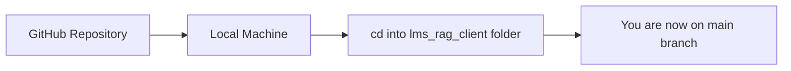
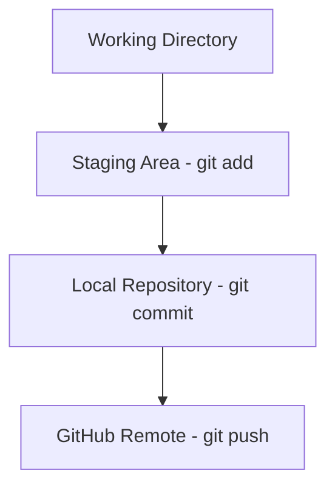

# 🤝 Contributing Guide

This guide will walk you through the steps to start working on a new feature or bug fix.

---

## 🔁 Clone the Repository

To begin contributing, first **clone the repository** to your local machine:

1. Open **Command Prompt**, **PowerShell**, or **Terminal** in your desired folder (e.g., Desktop).
2. Run the following commands:

```bash
git clone https://github.com/masudf6/lms_rag_client.git
cd lms_rag_client
```

### 📌 What this does:

<details>
<summary>Diagram</summary>



</details>

---

## 🌱 Create a New Branch

Never work directly on the `main` branch. Instead, create a **feature** or **fix** branch.

### Command:
```bash
git checkout -b feature/your-feature-name
```

### 🧠 Examples:
- For a login feature:
  ```bash
  git checkout -b feature/login
  ```
- For fixing a bug on the register page:
  ```bash
  git checkout -b fix/remove-register-bug
  ```

✅ **Tip**: Use clear, consistent naming conventions like `feature/` or `fix/` to make branch purposes obvious.

---

## ✍️ Make Changes, Commit, and Push

Once you're done with your changes, follow these steps to push your code.

### Commands:
```bash
git add .                         # Stage all changes
git commit -m "Short message"     # Commit changes with a meaningful message
git push origin feature/your-feature-name  # Push your branch to GitHub
```

### 🧭 Visual Guide:

<details>
<summary>Diagram</summary>



</details>

✅ **Tip**: Write concise commit messages, e.g., `"Fix input validation on login form"`.

---

## 🔄 Keeping Your Main Branch Updated

If you've already cloned the repo and want to work on another feature later:

### 1. Go to `main` branch:
```bash
git checkout main
```

### 2. Pull the latest code from GitHub:
```bash
git pull origin main
```

### 3. Create a new branch:
```bash
git checkout -b feature/your-new-feature
```

### 4. Make changes, commit, and push (same as above):
```bash
git add .
git commit -m "Added new feature"
git push origin feature/your-new-feature
```

---

## ✅ Final Notes

- 🚫 Don’t push directly to the `main` branch.
- 🌱 Always create a new branch for each feature or fix.
- 🧠 Follow clear naming conventions and commit messages.
- 🔁 Create a **Pull Request (PR)** once your feature branch is pushed and ready for review.
- 🧹 Keep your branch up-to-date by regularly pulling changes from `main`.
